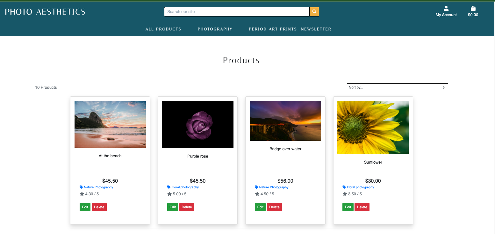
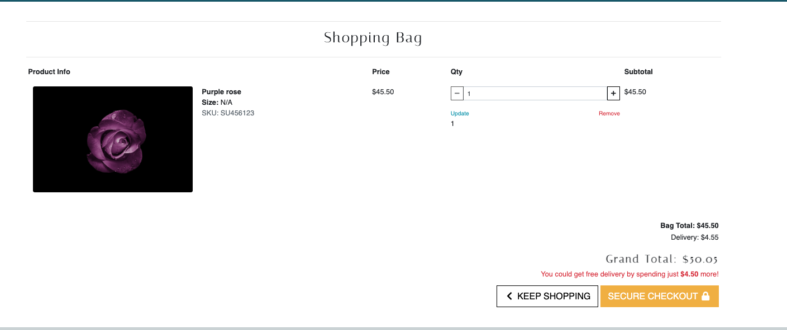

# **Cogito, ergo sum**

# Photo Aesthetics

## **Table of Contents**

1. [About this project](#About-project)
2. [SEO and Marketing](#SEO-marketing)
3. [UX design](#UX)
4. [Agile Methodology and User Stories](#user-stories)
5. [Main Features](#features)
6. [Wireframes](#wireframes)
8. [Testing](#testing)
9. [Technologies used](#technologies)
6. [Deployment](#deployment)
9. [Credits](#credits)

## **About this project**
This is a fully-responsive e-commerce website that was built using Django framework with Python and Booostrap as main technologies. 
This website represents an online shop that sells high quality photo prints and fine art prints. It sells also has prints of period or vintage art pieces. 
Users can login for an account and they can sign up to the newsletter. They can add their favorite prints to the wishlist and view these items from their profile. 
The targeted demographis is anyone who enjoys art and photography and want to buy good quality prints.  

## **SEO and Marketing**

## **Agile Methodology and User Stories**
User Stories have been achieved to built this website as follows:

### Viewing product and navigation

As a Shopper I can view a list of products so that I can see what the shop can offer 

As a Shopper I can view specific product details so that I can see the price, description and product image

As a Shopper I can register for an account so that I can set up a profile for the website and view it

As a Shopper I can see all my purchases so that I can see how much I spent on each item

As a Shopper I can see what is in my shopping bag so I can can check all the items are correct

As a Shopper I can identify the categories of products on the website so I can see all my options before making a purchase

### Registration and User accounts

- As a Shopper I can login and logout so that I can access my personal account information

- As a Shopper I can easily recover my password if I forget it so that I can access my account info and purchase history

- As a Shopper I can receive a registration confirmation email so that I can verify my registration to the site was successful

- As a Shopper I can set up a personalised user profile so that I can view my order history and personal details

### Searching and Sorting products

- As a Shopper I can sort the list of available products so that I can easily identify best priced and categorically sorted products

- As a Shopper I can sort a specific category of product so that I can find the best priced in a specific category or sort the products by name

- As a Shopper I can sort multiple categories of products at the same time so that I can find the best priced products across categories such as ‘photography’ or ‘period art prints’.

- As a Shopper I can search for a product by name or description so that I can find specific product I’d like to purchase

- As a Shopper I can see the number of results for my search so I can see if the product I want is available

### Purchasing and Checkout

- As a Shopper I can select the size and quantity of products when purchasing them so that I can be sure I make no mistakes about the quantity and print size

- As a Shopper I can see messages from the shop so that I know if my item was added to the bag or removed

- As a Shopper I can view items in my bag to be purchased so that I can identify the total cost of my purchase and all items I will receive

- As a Shopper I can adjust the quantity of items in my bag so that I can make changes to my purchase before checkout

- As a Shopper I can easily enter my payment information so that I can add to checkout my desired products

- As a Shopper I know that my personal and payment information is safe and secure so that I can confidently provide the necessary card details to make a purchase

### Wishlist

- As a Shopper I can navigate to a product and click on the add to Wishlist button so that I can add the products I want to purchase in the future

- As a Shopper I can navigate to My Profile and remove items from My Wishlist so that I can remove a product I’m not interested in buying anymore

### Admin & Management (CRUD)

- As an Admin User I can add new products to the website so that I can provide clients with new incoming products.

- As an Admin User I can modify product details so that I can update product details

- As an Admin User I can delete products so that I can update the site when a product isn’t being sold anymore

### Newsletter subscriber

- As a **Shopper / Admin** I want to **register to the site's newsletter** so that **I can be kept up to date with marketing updates and news**

- As a Shopper / Admin I can see a pop up message when signing up for newsletter

### Pop up messages / Toasts

- As a site user I want to see pop-up messages when I make an action to confirm transactions and changes** so that I can rest assured my transactions and activities have been successful**

### Deploy project

- As a Shopper I can access the website in a publicly accessible domain so that I can view the website and use its functionalities

### User Stories to implement

- As a Shopper I want to be able to see price changing depending on which print size I chose so that I can see if the price is different or not.

### Kanban board

## **SEO and Marketing**
I've created a custom Newsletter model to send marketing emails and updates on new products and releases. 

I've also create a Facebook business page in order to keep in touch with clients and users on social media as well.
The page can be accessed here [Facebook page](https://www.facebook.com/profile.php?id=100083382653686)

### SEO
In order to improve SEO for this website I've used several main keywords such as fine art prints, period art prints, nature photography. I've also used descriptive meta tags such as landscape photography and calm landscape prints. 

## UX design
In building this website, I've followed the principles of UX design and implemented features that are responsive, are visually pleasing and overall create a good experience for the User.
The footer and header have a bold thene color counteracted by the yellow-mustardy color of the buttons. I left everything else simple as not to overpower the products which are the focus of the website. 

## **Main Features**

### Existing features
- Home page

- Popular products section

- Footer

- All products page

- Category page

- Product detail page

- Success messages

- Shopping bag

- Checkout page

- Thank you page after purchase

- Signup to Newsletter

- Add Product

- Profile

- Wishlist

## **Wireframes**

- Homepage

- All Products

- Product detail

- Shopping bag

## **Testing**

Testing has been done manually, I'v tested the website on various smart devices - phones and tablets. I'v also goen to Inspect in Chrome Developper tools and adjusted the size of the screen there as well. 

- **Login/logout/register:** The user can use all these features with no errors, pop up messages appearing as well.

- **Search bar:** I can search for products and all products are being displayed and also the number of results that are returned. 

- **Navigation bar:** All the links to the different categories (including their dropdown menus) and the newsletter link are working correctly.
- **Producr details:** I can access product detail page and click on add to wishlist, edit, delete, change print size and increment and decrement quantity. Admin can click on edit and delete buttons. Admin is promoted to confirm if they want to delete the product. 

- **Product Management:** From 'My Account' dropdown menu the superuser can add products with and without images. 

- **Footer:** All the links to social media working correctly and as expected, no broken links.

- **My profile:** The dropdown menu works as expected and no broken links. When clicking the menu responds to the different types of users (admin functions appear when superuser is logged in and not present for site users) and if the user is logged in or not.

- **Bag:** The feature is working as expected as well, link to the selected products are working correctly, the quantity can be amended as well with no issues (quantity doesn't go beyond 99 or below 1), 'Update' and 'Remove' buttons working as well as 'Keep Shopping' and 'Secure Checkout'.

- **Checkout:** Page loading successfully, delivery information also adds correctly to the delivery form as well as good functioning of 'Adjust Bag' and 'Complete Order' buttons. The summary of selected items to buy show correctly including the print image, quantity selected, subtotal, total, delivery amount and grand total.

- **Newsletter:** Subscribing for the newsletter feature working correctly, when subscribing with a new email and confirmation email is sent to the entered address and if an existing email address is added an informational pop up message appears informing so.

- **My profile:** Both site user and superuser can enter access their profile information through 'My Account' dropdown menu. The default delivery information can be updated with no issues, and the order history is available, the links to each order details is accessible (no broken links). 
User can also see their Wishlist items only if they create an account. 

- **Pop Up Messages:** All pop up messages working correctly and appearing when expected: confirmation to confirm purchases, information when a product is added to wishlist and warning messages when something goes wrong. 
#### **Validator Testing**

- Used [PEP8online.com](http://pep8online.com/) to validate Python code.
There are several errors due to line being too long. The screenshots from th testing can be found in the Readme docs

- Used [W3C](https://validator.w3.org) to validate HTML and CSS code
However mostly due to the use of django templating I receiced several issues 

- Lighthouse report can be see as below

#### **Remaining bugs**
- When making a payment with Stripe test credit card, I check the webhook in Stripe and the payment is successful. The use doesn't receive a confirmation email regardless of wether the payment is successfull or not. 

## **Technologies Used**

- [Gitpod](https://gitpod.io/)
- [Github](https://github.com/)
- All credits go to [Unsplash](https://unsplash.com/) and from the online album provided by the Brittish Lirabry on
[Flickr](https://www.flickr.com/photos/britishlibrary/albums/72157640831988343/with/12459046025/)
All images from both websites are royalty free.

- [Django](https://www.djangoproject.com/)
- [Heroku](https://id.heroku.com/)
- [Balsamiq](https://balsamiq.cloud/)
- [PEP8online.com](http://pep8online.com/)
- [W3C](https://validator.w3.org/#validate_by_input)
- [Stackoverflow](https://stackoverflow.com/)
- [Bootstrap](https://getbootstrap.com/)
- [Coolors](https://coolors.co/)

## **Deployment**

### GitHub Pages
The project was deployed to GitHub Pages using the following steps:
1. Go to GitHub and locate the repository to be deployed [GitHub Repository](https://github.com/Shoshie-coding/project-1)
2. On the top right-hand side - click Settings
3. Scroll down until you locate the Pages tab on the left-hand side navigation menu. 
4. Under Source - click on the drop-down called None and select Main and leave the /(root) option as it is. 
5. Click Save 
6.  The Page refreshes itself - message " Your site is ready to be published at https://shoshie-coding.github.io/project-1/. 
7. Refresh page - notice message -  Your site is published at https://shoshie-coding.github.io/project-1/. 

### Deployment on Heroku

This project was deployed on Heroku using these steps:

2. Log in to Heroku and create a new app.
3. Add the Heroku Postgres add-on
4. Go to gitpod workspace and install dj_database_url and psycopg2 and freeze requierements in requirements.txt
5. Make migrations, load categories and respective products
6. Create Heroku Super User and follow onscreen prompts
8. Create an if statement so debug is set be true only if there's a variable called development in os.environ otherwise it will use the default configuration.
9. Create a Procfile to tell Heroku to create a web dyno;
10. Disable COLLECTSTATIC with command 'heroku config:set DISABLE_COLLECTSTATIC=1 --app photo-aesthetics'
11. Add the Heroku app under ALLOWED_HOSTS in Settings.py
12. Deploy to Heroku
13. In Heroku, inside the app go to Deploy tab and set deploy to Github, search for the project repo and click connect. Set deployment to automatic preferably so 
12. Generate secret key for the Heroku app and add it to env.py which is included in the .gitignore file for safety purposes. 
13. In settings.py set up debug to true only if there is a variable called development in the environment;

### Clone a repository using these steps:
1. On GitHub, navigate to the main page of the repository.

2. Above the list of files, click the Code button.
3. To clone the repository using HTTPS, under "Clone with HTTPS", click the clone symbol. To clone the repository using an SSH key, including a certificate issued by your organization's SSH certificate authority, click Use SSH, then click the clone symbol next to it. To clone a repository using GitHub CLI, click Use GitHub CLI, then click the same clone symbol .
4. Open Git Bash and change the current working directory to the location where you want the cloned directory.

5. Type git clone, and then paste the URL you copied earlier.

6. You will see a message confirmation that the command was successul.

## Acknowledgments

My mentor for feedback and guiding me throughout the process and everyone at Code Institute who provided helpful tips along the way.

